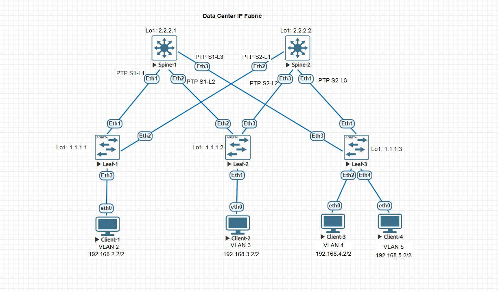

### Проектирование адресного пространства

### Цели:
  1: Собрать схему CLOS.
  2: Распределить адресное пространство.

### Реализовать схему CLOS:




### Распределить адресное пространство:

### VLAN 2

|Device|Interface|IP Address|Subnet Mask|Default Gateway
|---|---|---|---|---|
Leaf-1|Eth3|192.168.2.1|255.255.255.0|N/A
Client-1|Eth0|192.168.2.2|255.255.255.0|192.168.2.1

### VLAN 3

|Device|Interface|IP Address|Subnet Mask|Default Gateway
|---|---|---|---|---|
Leaf-2|Eth1|192.168.3.1|255.255.255.0|N/A
Client-2|Eth0|192.168.3.2|255.255.255.0|192.168.3.1


### VLAN 4

|Device|Interface|IP Address|Subnet Mask|Default Gateway
|---|---|---|---|---|
Leaf-3|Eth2|192.168.4.1|255.255.255.0|N/A
Client-3|Eth0|192.168.4.2|255.255.255.0|192.168.4.1


### VLAN 5

|Device|Interface|IP Address|Subnet Mask|Default Gateway
|---|---|---|---|---|
Leaf-3|Eth4|192.168.5.1|255.255.255.0|N/A
Client-4|Eth0|192.168.5.2|255.255.255.0|192.168.5.1


### PTP link

|IP subnet|Subnet Mask|Description
|---|---|---|
172.16.1.0|255.255.255.252|Leaf1-Spine1
172.16.2.0|255.255.255.252|Leaf1-Spine2
172.16.3.0|255.255.255.252|Leaf2-Spine1
172.16.4.0|255.255.255.252|Leaf2-Spine2
172.16.5.0|255.255.255.252|Leaf3-Spine1
172.16.6.0|255.255.255.252|Leaf3-Spine2


### Loopback link

|Device|IP Address|Subnet Mask
|---|---|---|
Leaf-1|1.1.1.1|255.255.255.255
Leaf-2|1.1.1.2|255.255.255.255
Leaf-3|1.1.1.3|255.255.255.255
Spine-1|2.2.2.1|255.255.255.255
Spine-2|2.2.2.2|255.255.255.255


### Management link

|Device|IP Address|Subnet Mask
|---|---|---|
Leaf-1|192.168.10.1|255.255.255.0
Leaf-2|192.168.10.2|255.255.255.0
Leaf-3|192.168.10.3|255.255.255.0
Spine-1|192.168.10.4|255.255.255.0
Spine-2|192.168.10.5|255.255.255.0


#### Настройка Leaf-1

```
Leaf-1#show ip interface brief
                                                                        Address
Interface       IP Address          Status     Protocol          MTU    Owner
--------------- ------------------- ---------- ------------- ---------- -------
Ethernet1       172.16.1.1/30       up         up               1500
Ethernet2       172.16.2.1/30       up         up               1500
Ethernet3       192.168.2.1/24      up         up               1500
Loopback1       1.1.1.1/32          up         up              65535
Management1     192.168.10.1/24     up         up               1500
```

#### Настройка Leaf-2

```
Leaf-2#show ip interface brief
                                                                        Address
Interface       IP Address          Status     Protocol          MTU    Owner
--------------- ------------------- ---------- ------------- ---------- -------
Ethernet1       192.168.3.1/24       up         up               1500
Ethernet2       172.16.3.1/30       up         up               1500
Ethernet3       172.16.4.1/30      up         up               1500
Loopback1       1.1.1.2/32          up         up              65535
Management1     192.168.10.2/24     up         up               1500
```


#### Настройка Leaf-3

```
 Leaf-2#show ip interface brief
                                                                        Address
Interface       IP Address          Status     Protocol          MTU    Owner
--------------- ------------------- ---------- ------------- ---------- -------
Ethernet1       172.16.6.1/30       up         up               1500
Ethernet2       192.168.4.1/24       up         up               1500
Ethernet3       172.16.5.1/30      up         up               1500
Ethernet4       192.168.5.1/24      up         up               1500
Loopback1       1.1.1.3/32          up         up              65535
Management1     192.168.10.3/24     up         up               1500
```


#### Настройка Spine-1

```
 Leaf-2#show ip interface brief
                                                                        Address
Interface       IP Address          Status     Protocol          MTU    Owner
--------------- ------------------- ---------- ------------- ---------- -------
Ethernet1       172.16.1.2/30       up         up               1500
Ethernet2       172.16.3.2/30       up         up               1500
Ethernet3       172.16.5.2/30      up         up               1500
Loopback1       2.2.2.1/32          up         up              65535
Management1     192.168.10.4/24     up         up               1500
```

#### Настройка Spine-2

```
 Leaf-2#show ip interface brief
                                                                        Address
Interface       IP Address          Status     Protocol          MTU    Owner
--------------- ------------------- ---------- ------------- ---------- -------
Ethernet1       172.16.6.2/30       up         up               1500
Ethernet2       172.16.2.2/30       up         up               1500
Ethernet3       172.16.4.2/30      up         up               1500
Loopback1       2.2.2.2/32          up         up              65535
Management1     192.168.10.5/24     up         up               1500
```


