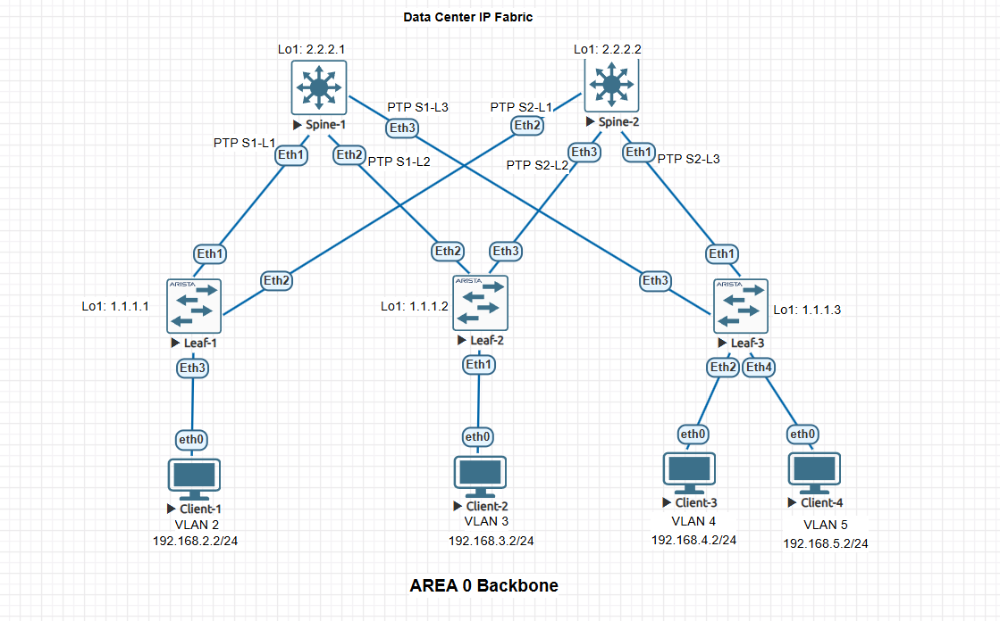
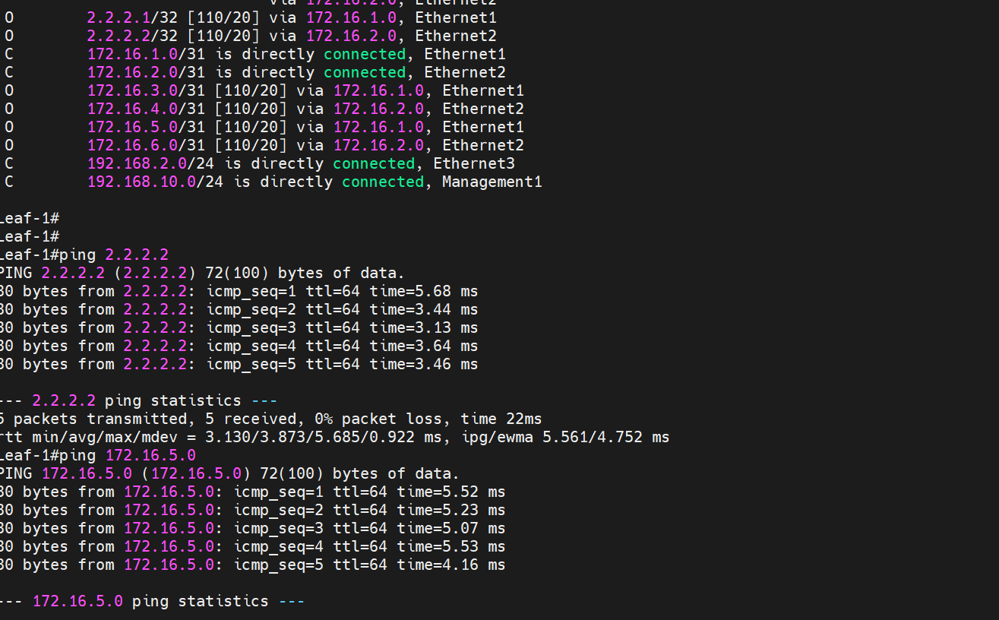
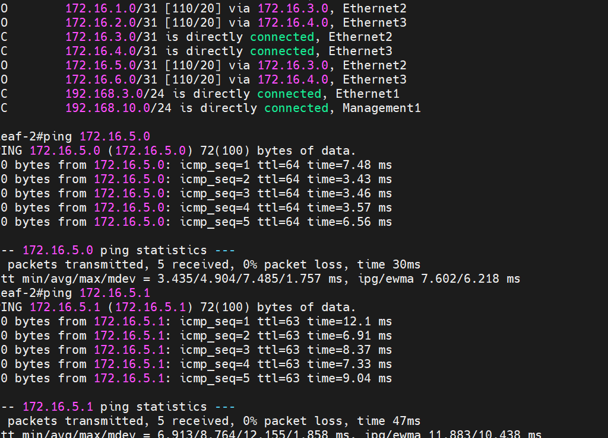
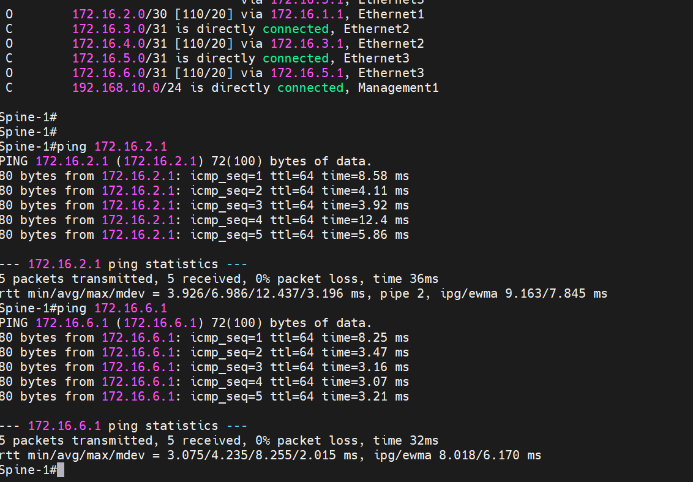

### Настроить OSPF для Underlay сети.

### Цели:
- Part 1: Настроите OSPF в Underlay сети, для IP связанности между всеми сетевыми устройствами.
- Part 2: Зафиксируете в документации - план работы, адресное пространство, схему сети, конфигурацию устройств
- Part 3: Убедитесь в наличии IP связанности между устройствами в OSFP домене

###  1 Настроите OSPF в Underlay сети, для IP связанности между всеми сетевыми устройствами.

### Настройка Leaf-1

```
Leaf-1#show running-config section ospf
interface Ethernet1
   ip ospf network point-to-point
   ip ospf area 0.0.0.0
interface Ethernet2
   ip ospf network point-to-point
   ip ospf area 0.0.0.0
interface Loopback1
   ip ospf area 0.0.0.0
router ospf 1
   router-id 1.1.1.1
   max-lsa 12000
Leaf-1#
```

### Настройка Leaf-2

```
`Leaf-2#show running-config section ospf
interface Ethernet2
   ip ospf network point-to-point
   ip ospf area 0.0.0.0
interface Ethernet3
   ip ospf network point-to-point
   ip ospf area 0.0.0.0
interface Loopback1
   ip ospf area 0.0.0.0
router ospf 1
   router-id 1.1.1.2
   max-lsa 12000
Leaf-2#
```

### Настройка Leaf-3

```
Leaf-3#show running-config section ospf
interface Ethernet1
   ip ospf network point-to-point
   ip ospf area 0.0.0.0
interface Ethernet3
   ip ospf network point-to-point
   ip ospf area 0.0.0.0
interface Loopback1
   ip ospf area 0.0.0.0
router ospf 1
   router-id 1.1.1.3
   max-lsa 12000
Leaf-3#
```

### Настройка Spine-1

```
Spine-1#show running-config section ospf
interface Ethernet1
   ip ospf network point-to-point
   ip ospf area 0.0.0.0
interface Ethernet2
   ip ospf network point-to-point
   ip ospf area 0.0.0.0
interface Ethernet3
   ip ospf network point-to-point
   ip ospf area 0.0.0.0
interface Loopback1
   ip ospf area 0.0.0.0
router ospf 1
   router-id 2.2.2.1
   max-lsa 12000
Spine-1#
```

### Настройка Spine-2

```
Spine-2#show running-config section ospf
interface Ethernet1
   ip ospf network point-to-point
   ip ospf area 0.0.0.0
interface Ethernet2
   ip ospf network point-to-point
   ip ospf area 0.0.0.0
interface Ethernet3
   ip ospf network point-to-point
   ip ospf area 0.0.0.0
interface Loopback1
   ip ospf area 0.0.0.0
router ospf 1
   router-id 2.2.2.2
   max-lsa 12000
Spine-2#
```


### 2 Зафиксируете в документации - план работы, адресное пространство, схему сети, конфигурацию устройств:


### Планы работ:
- 1:  Построить схему underlay  сети и определить адресное пространство
- 2:  Произвести первичную настройку сетевых устройств, в частности присвоить ip адреса интерфейсам  
- 3:  Настроить OSPF на сетевых устройствах 
- 4:  Проверить установилось ли соседство OSPF, и наличие маршрутов OSPF в таблице RIB
- 5:  Приложить конфиги устройств, в отдельных текстовых файлах


### Зафиксированное адресное пространство


### VLAN 2

|Device|Interface|IP Address|Subnet Mask|Default Gateway
|---|---|---|---|---|
Leaf-1|Eth3|192.168.2.1|255.255.255.0|N/A
Client-1|Eth0|192.168.2.2|255.255.255.0|192.168.2.1

### VLAN 3

|Device|Interface|IP Address|Subnet Mask|Default Gateway
|---|---|---|---|---|
Leaf-2|Eth1|192.168.3.1|255.255.255.0|N/A
Client-2|Eth0|192.168.3.2|255.255.255.0|192.168.3.1


### VLAN 4

|Device|Interface|IP Address|Subnet Mask|Default Gateway
|---|---|---|---|---|
Leaf-3|Eth2|192.168.4.1|255.255.255.0|N/A
Client-3|Eth0|192.168.4.2|255.255.255.0|192.168.4.1


### VLAN 5

|Device|Interface|IP Address|Subnet Mask|Default Gateway
|---|---|---|---|---|
Leaf-3|Eth4|192.168.5.1|255.255.255.0|N/A
Client-4|Eth0|192.168.5.2|255.255.255.0|192.168.5.1


### PTP link

|IP subnet|Subnet Mask|Description
|---|---|---|
172.16.1.0|255.255.255.254|Leaf1-Spine1
172.16.2.0|255.255.255.254|Leaf1-Spine2
172.16.3.0|255.255.255.254|Leaf2-Spine1
172.16.4.0|255.255.255.254|Leaf2-Spine2
172.16.5.0|255.255.255.254|Leaf3-Spine1
172.16.6.0|255.255.255.254|Leaf3-Spine2


### Loopback link

|Device|IP Address|Subnet Mask
|---|---|---|
Leaf-1|1.1.1.1|255.255.255.255
Leaf-2|1.1.1.2|255.255.255.255
Leaf-3|1.1.1.3|255.255.255.255
Spine-1|2.2.2.1|255.255.255.255
Spine-2|2.2.2.2|255.255.255.255


### Management link

|Device|IP Address|Subnet Mask
|---|---|---|
Leaf-1|192.168.10.1|255.255.255.0
Leaf-2|192.168.10.2|255.255.255.0
Leaf-3|192.168.10.3|255.255.255.0
Spine-1|192.168.10.4|255.255.255.0
Spine-2|192.168.10.5|255.255.255.0


### Схема underlay сети OSPF




### 3 Убедитесь в наличии IP связанности между устройствами в OSFP домене






