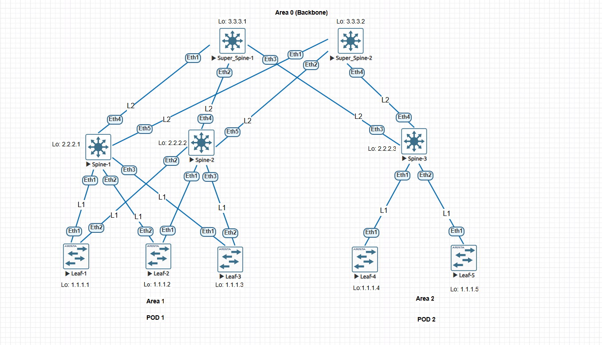
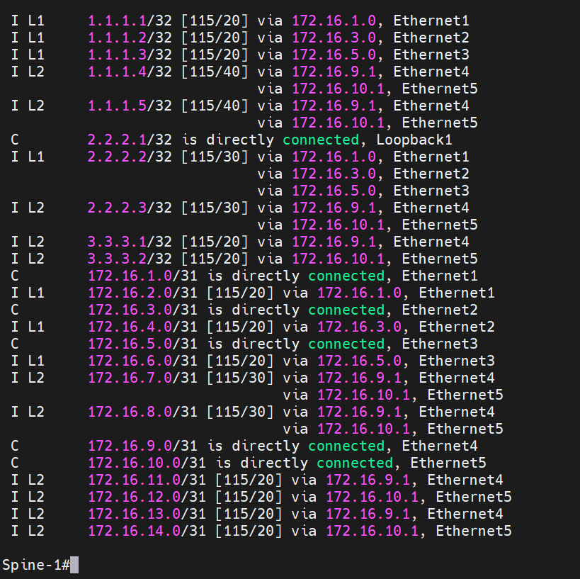
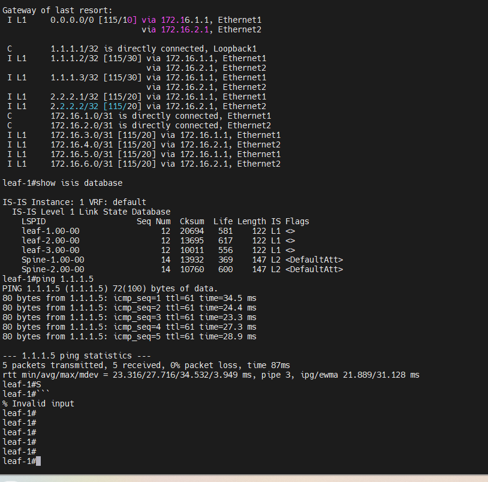
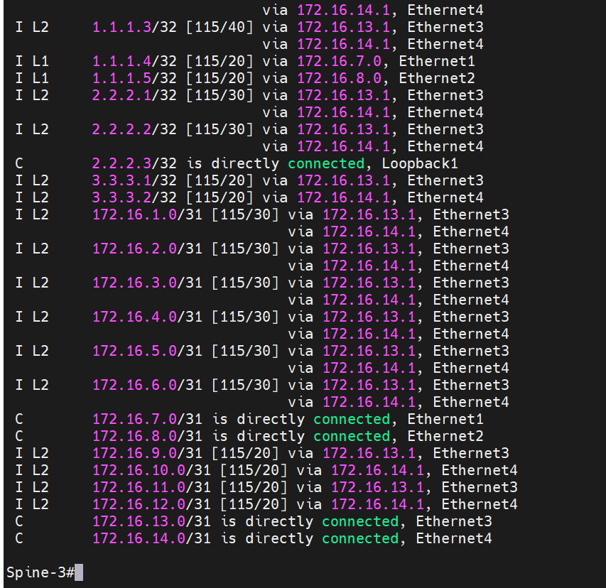
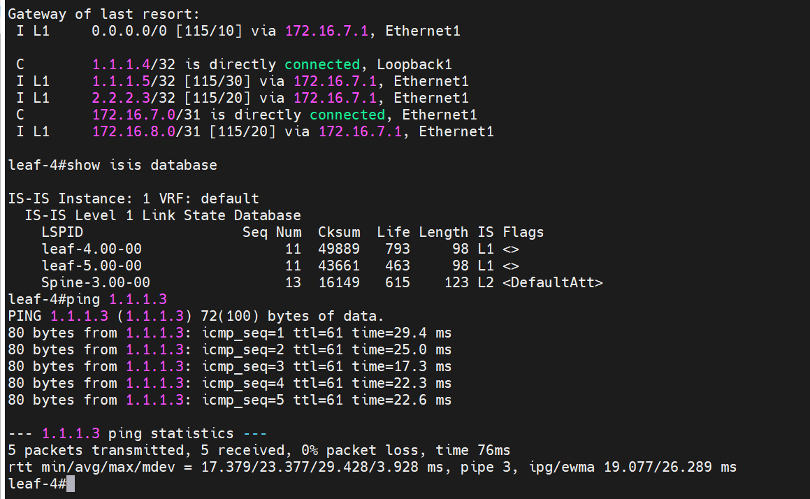
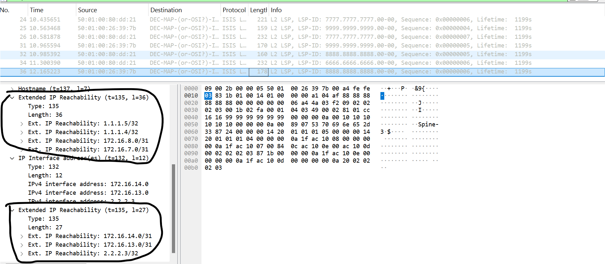

### Настроить IS-IS для Underlay сети.

### Цели: 

- Part 1: Настроите IS-IS в Underlay сети, для IP связанности между всеми сетевыми устройствами.
- Part 2: Зафиксируете в документации - план работы, адресное пространство, схему сети, конфигурацию устройств
- Part 3: Убедитесь в наличии IP связанности между устройствами в IS-IS домене


###  1 Настроите IS-IS в Underlay сети, для IP связанности между всеми сетевыми устройствами.

### Настройка Leaf-1

```
leaf-1#show running-config section isis
interface Ethernet1
   isis enable 1
   isis circuit-type level-1
   isis network point-to-point
interface Ethernet2
   isis enable 1
   isis circuit-type level-1
   isis network point-to-point
interface Loopback1
   isis enable 1
router isis 1
   net 49.0001.1111.1111.1111.00
   is-type level-1
   !
   address-family ipv4 unicast
leaf-1#
```

### Настройка Leaf-2

```
leaf-2#show running-config section isis
interface Ethernet1
   isis enable 1
   isis circuit-type level-1
   isis network point-to-point
interface Ethernet2
   isis enable 1
   isis circuit-type level-1
   isis network point-to-point
interface Loopback1
   isis enable 1
router isis 1
   net 49.0001.2222.2222.2222.00
   is-type level-1
   !
   address-family ipv4 unicast
leaf-2#
```

### Настройка Leaf-3

```
leaf-3#show running-config section isis
interface Ethernet1
   isis enable 1
   isis circuit-type level-1
   isis network point-to-point
interface Ethernet2
   isis enable 1
   isis circuit-type level-1
   isis network point-to-point
interface Loopback1
   isis enable 1
router isis 1
   net 49.0001.3333.3333.3333.00
   is-type level-1
   !
   address-family ipv4 unicast
leaf-3#
```

### Настройка Leaf-4

```
leaf-4#show running-config section isis
interface Ethernet1
   isis enable 1
   isis circuit-type level-1
   isis network point-to-point
interface Loopback1
   isis enable 1
router isis 1
   net 49.0002.4444.4444.4444.00
   is-type level-1
   !
   address-family ipv4 unicast
leaf-4#
```
### Настройка Leaf-5
```
leaf-5#show running-config section isis
interface Ethernet1
   isis enable 1
   isis circuit-type level-1
   isis network point-to-point
interface Loopback1
   isis enable 1
router isis 1
   net 49.0002.5555.5555.5555.00
   is-type level-1
   !
   address-family ipv4 unicast
leaf-5#
```

### Настройка Spine-1

```
Spine-1#show running-config section isis
interface Ethernet1
   isis enable 1
   isis circuit-type level-1
   isis network point-to-point
interface Ethernet2
   isis enable 1
   isis circuit-type level-1
   isis network point-to-point
interface Ethernet3
   isis enable 1
   isis circuit-type level-1
   isis network point-to-point
interface Ethernet4
   isis enable 1
   isis circuit-type level-2
   isis network point-to-point
interface Ethernet5
   isis enable 1
   isis circuit-type level-2
   isis network point-to-point
interface Loopback1
   isis enable 1
router isis 1
   net 49.0001.6666.6666.6666.00
   !
   address-family ipv4 unicast
Spine-1#
```

### Настройка Spine-2

```
Spine-2#show running-config section isis
interface Ethernet1
   isis enable 1
   isis circuit-type level-1
   isis network point-to-point
interface Ethernet2
   isis enable 1
   isis circuit-type level-1
   isis network point-to-point
interface Ethernet3
   isis enable 1
   isis circuit-type level-1
   isis network point-to-point
interface Ethernet4
   isis enable 1
   isis circuit-type level-2
   isis network point-to-point
interface Ethernet5
   isis enable 1
   isis circuit-type level-2
   isis network point-to-point
interface Loopback1
   isis enable 1
router isis 1
   net 49.0001.7777.7777.7777.00
   !
   address-family ipv4 unicast
Spine-2#
```

### Настройка Spine-3

```
Spine-3#show running-config section isis
interface Ethernet1
   isis enable 1
   isis circuit-type level-1
   isis network point-to-point
interface Ethernet2
   isis enable 1
   isis circuit-type level-1
   isis network point-to-point
interface Ethernet3
   isis enable 1
   isis circuit-type level-2
   isis network point-to-point
interface Ethernet4
   isis enable 1
   isis circuit-type level-2
   isis network point-to-point
interface Loopback1
   isis enable 1
router isis 1
   net 49.0002.8888.8888.8888.00
   !
   address-family ipv4 unicast
Spine-3#
```

### Настройка Super_Spine-1

```
Super-Spine-1#show running-config section isis
interface Ethernet1
   isis enable 1
   isis circuit-type level-2
   isis network point-to-point
interface Ethernet2
   isis enable 1
   isis circuit-type level-2
   isis network point-to-point
interface Ethernet3
   isis enable 1
   isis circuit-type level-2
   isis network point-to-point
interface Loopback1
   isis enable 1
router isis 1
   net 49.0000.9999.9999.9999.00
   !
   address-family ipv4 unicast
Super-Spine-1#
```
### Настройка Super_Spine-2

```
Super-Spine-2#show running-config section isis
interface Ethernet1
   isis enable 1
   isis circuit-type level-2
   isis network point-to-point
interface Ethernet2
   isis enable 1
   isis circuit-type level-2
   isis network point-to-point
interface Ethernet4
   isis enable 1
   isis circuit-type level-2
   isis network point-to-point
interface Loopback1
   isis enable 1
router isis 1
   net 49.0000.1010.1010.1010.00
   !
   address-family ipv4 unicast
Super-Spine-2#
```

### 2 Зафиксируете в документации - план работы, адресное пространство, схему сети, конфигурацию устройств:


### Планы работ:
- 1:  Построить схему underlay  сети и определить адресное пространство
- 2:  Произвести первичную настройку сетевых устройств, в частности присвоить ip адреса интерфейсам  
- 3:  Настроить IS-IS на сетевых устройствах 
- 4:  Проверить установилось ли соседство IS-IS, и наличие маршрутов IS-IS в таблице RIB
- 5:  Приложить конфиги устройств, в текстовом формате

### Зафиксированное адресное пространство

### PTP link

|IP subnet|Subnet Mask|Description
|---|---|---|
172.16.1.0|255.255.255.254|Leaf1-Spine1
172.16.2.0|255.255.255.254|Leaf1-Spine2
172.16.3.0|255.255.255.254|Leaf2-Spine1
172.16.4.0|255.255.255.254|Leaf2-Spine2
172.16.5.0|255.255.255.254|Leaf3-Spine1
172.16.6.0|255.255.255.254|Leaf3-Spine2
172.16.7.0|255.255.255.254|Leaf4-Spine3
172.16.8.0|255.255.255.254|Leaf5-Spine3
172.16.9.0|255.255.255.254|Spine1-Super_Spine1
172.16.10.0|255.255.255.254|Spine1-Super_Spine2
172.16.11.0|255.255.255.254|Spine2-Super_Spine1
172.16.12.0|255.255.255.254|Spine2-Super_Spine2
172.16.13.0|255.255.255.254|Spine3-Super_Spine1
172.16.14.0|255.255.255.254|Spine3-Super_Spine2


### Loopback link

|Device|IP Address|Subnet Mask
|---|---|---|
Leaf-1|1.1.1.1|255.255.255.255
Leaf-2|1.1.1.2|255.255.255.255
Leaf-3|1.1.1.3|255.255.255.255
Leaf-4|1.1.1.4|255.255.255.255
Leaf-5|1.1.1.5|255.255.255.255
Spine-1|2.2.2.1|255.255.255.255
Spine-2|2.2.2.2|255.255.255.255
Spine-3|2.2.2.3|255.255.255.255
Super_Spine1|3.3.3.1|255.255.255.255
Super_Spine2|3.3.3.2|255.255.255.255


### Схема underlay сети ISIS




### 3 Убедитесь в наличии IP связанности между устройствами в OSFP домене






### Сниффинг пакетов в Wireshark



Анализируя дамп пакета, можно увидеть как сосед под идентификатором 8888.8888.8888, передает  L2 маршруты ip сетей

Конфиги устройств, прикладываю в отдельной папке


