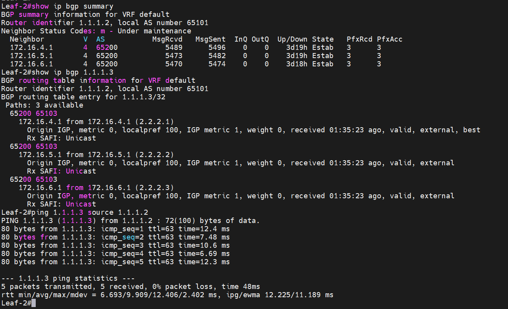

### Настроить eBGP для Underlay сети.

### Цели: 

- Part 1: Настроите eBGP в Underlay сети, для IP связанности между всеми сетевыми устройствами.
- Part 2: Зафиксируете в документации - план работы, адресное пространство, схему сети, конфигурацию устройств
- Part 3: Убедитесь в наличии IP связанности между устройствами в eBGP домене


###  1 Настроите eBGP в Underlay сети, для IP связанности между всеми сетевыми устройствами.

### Настройка Leaf-1

```
Leaf-1#show running-config section bgp
router bgp 65100
   router-id 1.1.1.1
   maximum-paths 3
   neighbor UNDERLAY peer group
   neighbor UNDERLAY remote-as 65200
   neighbor UNDERLAY bfd
   neighbor 172.16.1.1 peer group UNDERLAY
   no neighbor 172.16.1.1 route-map out
   neighbor 172.16.2.1 peer group UNDERLAY
   neighbor 172.16.3.1 peer group UNDERLAY
   redistribute connected route-map ADVERT_NET
Leaf-1#
```

### Настройка Leaf-2

```
Leaf-2#show running-config section bgp
router bgp 65101
   router-id 1.1.1.2
   neighbor UNDERLAY peer group
   neighbor UNDERLAY remote-as 65200
   neighbor UNDERLAY bfd
   neighbor 172.16.4.1 peer group UNDERLAY
   neighbor 172.16.5.1 peer group UNDERLAY
   neighbor 172.16.6.1 peer group UNDERLAY
   redistribute connected route-map ADVERT_NET
Leaf-2#
```

### Настройка Leaf-3

```
Leaf-3#show running-config section bgp
router bgp 65103
   router-id 1.1.1.3
   neighbor UNDERLAY peer group
   neighbor UNDERLAY remote-as 65200
   neighbor UNDERLAY bfd
   neighbor 172.16.7.1 peer group UNDERLAY
   neighbor 172.16.8.1 peer group UNDERLAY
   neighbor 172.16.9.1 peer group UNDERLAY
   redistribute connected route-map ADVERT_NET
Leaf-3#
```

### Настройка Leaf-4

```
Leaf-4#show running-config section bgp
router bgp 65104
   router-id 1.1.1.4
   neighbor UNDERLAY peer group
   neighbor UNDERLAY remote-as 65200
   neighbor UNDERLAY bfd
   neighbor 172.16.10.1 peer group UNDERLAY
   neighbor 172.16.11.1 peer group UNDERLAY
   neighbor 172.16.12.1 peer group UNDERLAY
   redistribute connected route-map ADVERT_NET
Leaf-4#
```

### Настройка Spine-1

```
Spine-1#show running-config section bgp
ip as-path access-list RM_BGP permit ^651([0-4][0-9]|50|00)$ any
router bgp 65200
   router-id 2.2.2.1
   bgp listen range 172.16.0.0/20 peer-group UNDERLAY peer-filter ASN_LEAFS
   neighbor UNDERLAY peer group
   neighbor UNDERLAY bfd
Spine-1#
```

### Настройка Spine-2

```
Spine-2#show running-config section bgp
router bgp 65200
   router-id 2.2.2.2
   bgp listen range 172.16.0.0/20 peer-group UNDERLAY peer-filter ASN_LEAFS
   neighbor UNDERLAY peer group
   neighbor UNDERLAY bfd
Spine-2#
```

### Настройка Spine-3

```
Spine-3#show running-config section bgp
router bgp 65200
   router-id 2.2.2.3
   bgp listen range 172.16.0.0/20 peer-group UNDERLAY peer-filter ASN_LEAFS
   neighbor UNDERLAY peer group
   neighbor UNDERLAY bfd
Spine-3#
```


### 2 Зафиксируете в документации - план работы, адресное пространство, схему сети, конфигурацию устройств:


### Планы работ:
- 1:  Построить схему underlay  сети и определить адресное пространство
- 2:  Произвести первичную настройку сетевых устройств, в частности присвоить ip адреса интерфейсам  
- 3:  Настроить eBGP на сетевых устройствах 
- 4:  Проверить установилось ли соседство eBGP, и наличие маршрутов eBGP в таблице RIB
- 5:  Приложить конфиги устройств, в текстовом формате

### Зафиксированное адресное пространство

### PTP link

|IP subnet|Subnet Mask|Description
|---|---|---|
172.16.1.0|255.255.255.254|Leaf1-Spine1
172.16.2.0|255.255.255.254|Leaf1-Spine2
172.16.3.0|255.255.255.254|Leaf1-Spine3
172.16.4.0|255.255.255.254|Leaf2-Spine1
172.16.5.0|255.255.255.254|Leaf2-Spine2
172.16.6.0|255.255.255.254|Leaf2-Spine3
172.16.7.0|255.255.255.254|Leaf3-Spine1
172.16.8.0|255.255.255.254|Leaf3-Spine2
172.16.9.0|255.255.255.254|Leaf3-Spine3
172.16.10.0|255.255.255.254|Leaf4-Spine1
172.16.11.0|255.255.255.254|Leaf4-Spine2 
172.16.12.0|255.255.255.254|Leaf4-Spine3


### Loopback link

|Device|IP Address|Subnet Mask
|---|---|---|
Leaf-1|1.1.1.1|255.255.255.255
Leaf-2|1.1.1.2|255.255.255.255
Leaf-3|1.1.1.3|255.255.255.255
Leaf-4|1.1.1.4|255.255.255.255
Spine-1|2.2.2.1|255.255.255.255
Spine-2|2.2.2.2|255.255.255.255
Spine-3|2.2.2.3|255.255.255.255


### Схема underlay сети eBGP


### 3 Убедитесь в наличии IP связанности между устройствами в eBGP домене





Конфиги устройств, прикладываю в отдельной папке


