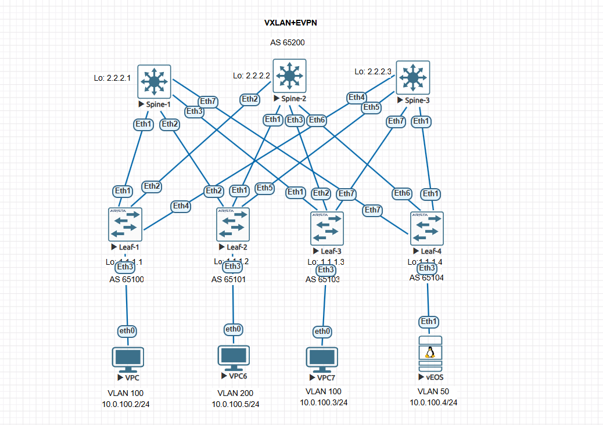
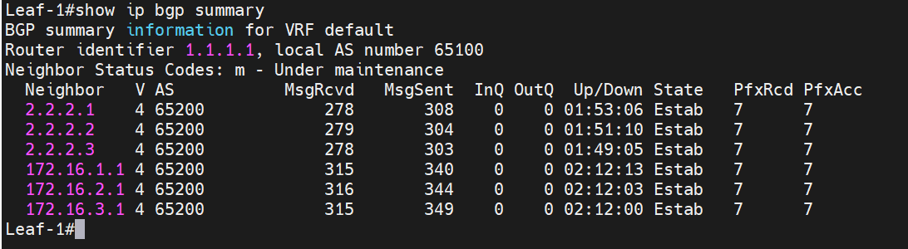
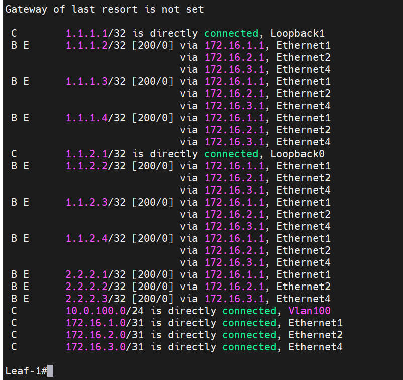
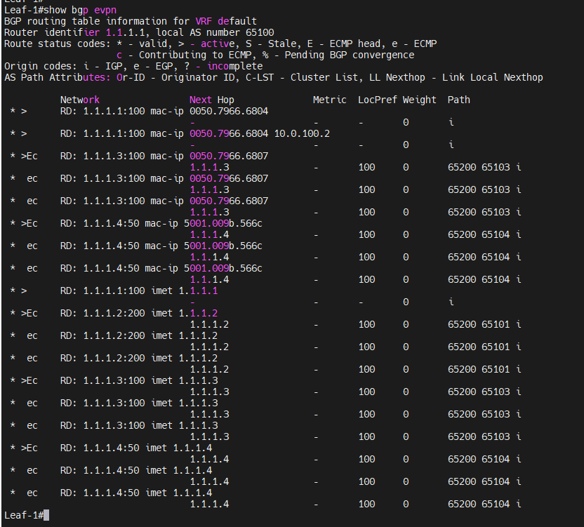
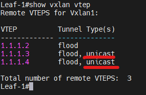
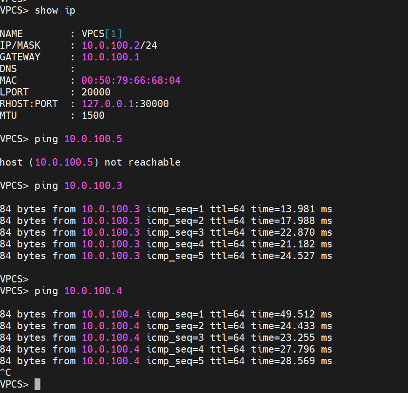
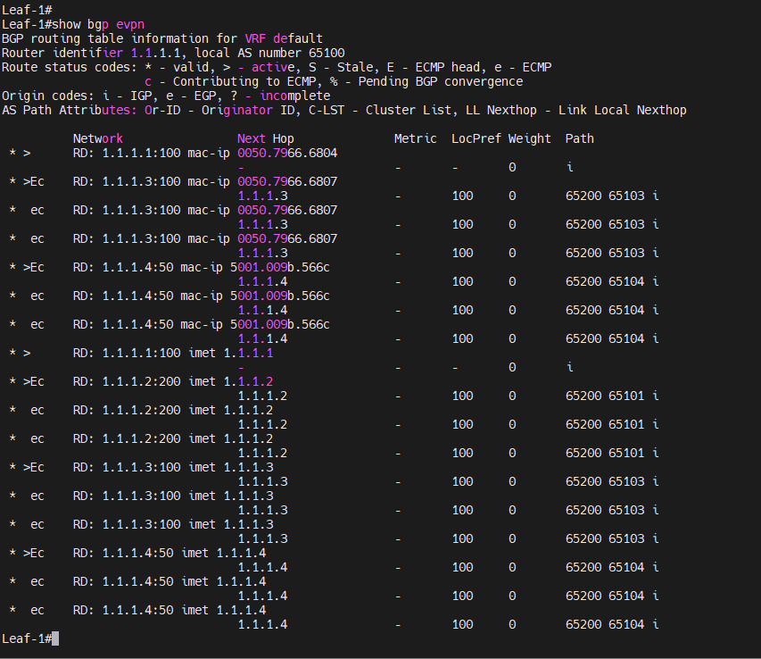

### Настроить Overlay на основе VxLAN EVPN для L2 связанности между клиентами.

### Цели: 

- Part 1: Настроите BGP peering между Leaf и Spine в AF l2vpn evpn.
- Part 2: Настроите связанность между клиентами в первой зоне и убедитесь в её наличии
- Part 3: Зафиксируете в документации - план работы, адресное пространство, схему сети, конфигурацию устройств


###  1 Настроите BGP peering между Leaf и Spine в AF l2vpn evpn.

### Настройка Leaf-1

```
Leaf-1#show running-config section bgp
Leaf-1#show running-config section bgp
router bgp 65100
   router-id 1.1.1.1
   maximum-paths 3 ecmp 3
   neighbor OVERLAY peer group
   neighbor OVERLAY remote-as 65200
   neighbor OVERLAY update-source Loopback0
   neighbor OVERLAY ebgp-multihop 10
   neighbor OVERLAY send-community extended
   neighbor UNDERLAY peer group
   neighbor UNDERLAY remote-as 65200
   neighbor UNDERLAY bfd
   neighbor 2.2.2.1 peer group OVERLAY
   neighbor 2.2.2.2 peer group OVERLAY
   neighbor 2.2.2.3 peer group OVERLAY
   neighbor 172.16.1.1 peer group UNDERLAY
   no neighbor 172.16.1.1 route-map out
   neighbor 172.16.2.1 peer group UNDERLAY
   neighbor 172.16.3.1 peer group UNDERLAY
   redistribute connected route-map ADVERT_NET
   !
   vlan 100
      rd auto
      route-target both 100:100100
      redistribute learned
   !
   address-family evpn
      neighbor OVERLAY activate
Leaf-1#
```

### Настройка Leaf-2

```
Leaf-2#show running-config section bgp
router bgp 65101
   router-id 1.1.1.2
   maximum-paths 3 ecmp 3
   neighbor OVERLAY peer group
   neighbor OVERLAY remote-as 65200
   no neighbor OVERLAY next-hop-unchanged
   neighbor OVERLAY update-source Loopback0
   neighbor OVERLAY ebgp-multihop 10
   neighbor OVERLAY send-community extended
   neighbor UNDERLAY peer group
   neighbor UNDERLAY remote-as 65200
   neighbor UNDERLAY bfd
   neighbor 2.2.2.1 peer group OVERLAY
   neighbor 2.2.2.2 peer group OVERLAY
   neighbor 2.2.2.3 peer group OVERLAY
   neighbor 172.16.4.1 peer group UNDERLAY
   neighbor 172.16.5.1 peer group UNDERLAY
   neighbor 172.16.6.1 peer group UNDERLAY
   redistribute connected route-map ADVERT_NET
   !
   vlan 200
      rd auto
      route-target both 100:100100
      redistribute learned
   !
   address-family evpn
      neighbor OVERLAY activate
Leaf-2#
```

### Настройка Leaf-3

```
Leaf-3#show running-config section bgp
router bgp 65103
   router-id 1.1.1.3
   maximum-paths 3 ecmp 3
   neighbor OVERLAY peer group
   neighbor OVERLAY remote-as 65200
   neighbor OVERLAY update-source Loopback0
   neighbor OVERLAY ebgp-multihop 10
   neighbor OVERLAY send-community extended
   neighbor UNDERLAY peer group
   neighbor UNDERLAY remote-as 65200
   neighbor UNDERLAY bfd
   neighbor 2.2.2.1 peer group OVERLAY
   neighbor 2.2.2.2 peer group OVERLAY
   neighbor 2.2.2.3 peer group OVERLAY
   neighbor 172.16.7.1 peer group UNDERLAY
   neighbor 172.16.8.1 peer group UNDERLAY
   neighbor 172.16.9.1 peer group UNDERLAY
   redistribute connected route-map ADVERT_NET
   !
   vlan 100
      rd auto
      route-target both 100:100100
      redistribute learned
   !
   address-family evpn
      neighbor OVERLAY activate
Leaf-3#
```

### Настройка Leaf-4

```
Leaf-4#show running-config section bgp
router bgp 65104
   router-id 1.1.1.4
   maximum-paths 3 ecmp 3
   neighbor OVERLAY peer group
   neighbor OVERLAY remote-as 65200
   neighbor OVERLAY update-source Loopback0
   neighbor OVERLAY ebgp-multihop 10
   neighbor OVERLAY send-community extended
   neighbor UNDERLAY peer group
   neighbor UNDERLAY remote-as 65200
   neighbor UNDERLAY bfd
   neighbor 2.2.2.1 peer group OVERLAY
   neighbor 2.2.2.2 peer group OVERLAY
   neighbor 2.2.2.3 peer group OVERLAY
   neighbor 172.16.10.1 peer group UNDERLAY
   neighbor 172.16.11.1 peer group UNDERLAY
   neighbor 172.16.12.1 peer group UNDERLAY
   redistribute connected route-map ADVERT_NET
   !
   vlan 50
      rd auto
      route-target both 100:100100
      redistribute learned
   !
   address-family evpn
      neighbor OVERLAY activate
Leaf-4#
```

### Настройка Spine-1

```
Spine-1#show running-config section bgp
ip as-path access-list RM_BGP permit ^651([0-4][0-9]|50|00)$ any
router bgp 65200
   router-id 2.2.2.1
   bgp listen range 1.1.0.0/16 peer-group OVERLAY peer-filter ASN_LEAFS
   bgp listen range 172.16.0.0/20 peer-group UNDERLAY peer-filter ASN_LEAFS
   neighbor OVERLAY peer group
   neighbor OVERLAY next-hop-unchanged
   neighbor OVERLAY update-source Loopback0
   neighbor OVERLAY ebgp-multihop 10
   neighbor OVERLAY send-community extended
   neighbor UNDERLAY peer group
   neighbor UNDERLAY bfd
   !
   address-family evpn
      neighbor OVERLAY activate
   !
   address-family ipv4
      network 2.2.2.1/32
Spine-1#
```

### Настройка Spine-2

```
Spine-2#show running-config section bgp
router bgp 65200
   router-id 2.2.2.2
   bgp listen range 1.1.0.0/16 peer-group OVERLAY peer-filter ASN_LEAFS
   bgp listen range 172.16.0.0/20 peer-group UNDERLAY peer-filter ASN_LEAFS
   neighbor OVERLAY peer group
   neighbor OVERLAY next-hop-unchanged
   neighbor OVERLAY update-source Loopback0
   neighbor OVERLAY ebgp-multihop 10
   neighbor OVERLAY send-community extended
   neighbor UNDERLAY peer group
   neighbor UNDERLAY bfd
   !
   address-family evpn
      neighbor OVERLAY activate
   !
   address-family ipv4
      network 2.2.2.2/32
Spine-2#
```

### Настройка Spine-3

```
Spine-3#show running-config section bgp
router bgp 65200
   router-id 2.2.2.3
   bgp listen range 1.1.0.0/16 peer-group OVERLAY peer-filter ASN_LEAFS
   bgp listen range 172.16.0.0/20 peer-group UNDERLAY peer-filter ASN_LEAFS
   neighbor OVERLAY peer group
   neighbor OVERLAY next-hop-unchanged
   neighbor OVERLAY update-source Loopback0
   neighbor OVERLAY ebgp-multihop 10
   neighbor OVERLAY send-community extended
   neighbor UNDERLAY peer group
   neighbor UNDERLAY bfd
   !
   address-family evpn
      neighbor OVERLAY activate
   !
   address-family ipv4
      network 2.2.2.3/32
Spine-3#
```


### 2 Зафиксируете в документации - план работы, адресное пространство, схему сети, конфигурацию устройств:


### Планы работ:
- 1:  Построить схему "Overlay на основе VxLAN EVPN"  
- 2:  Зафиксировать адресное пространство
- 3:  Поднять underlay для ip связанности (eBGP) и установить eBGP соседства между лифами и спайнами
- 4:  Проанонсировать лупбек адреса через eBGP  
- 5:  Поднять EVPN соседство между лифами и спайнами, и проверить таблицу RIB l2vpn+evpn
- 6:  Построить VXLAN тунель поверх underlay eBGP, проверить что тунели vxlan подняты и трафик по ним идет 
- 7:  Приложить конфиги устройств, в текстовом формате

### 1 Зафиксированное адресное пространство

### PTP link

|IP subnet|Subnet Mask|Description
|---|---|---|
172.16.1.0|255.255.255.254|Leaf1-Spine1
172.16.2.0|255.255.255.254|Leaf1-Spine2
172.16.3.0|255.255.255.254|Leaf1-Spine3
172.16.4.0|255.255.255.254|Leaf2-Spine1
172.16.5.0|255.255.255.254|Leaf2-Spine2
172.16.6.0|255.255.255.254|Leaf2-Spine3
172.16.7.0|255.255.255.254|Leaf3-Spine1
172.16.8.0|255.255.255.254|Leaf3-Spine2
172.16.9.0|255.255.255.254|Leaf3-Spine3
172.16.10.0|255.255.255.254|Leaf4-Spine1
172.16.11.0|255.255.255.254|Leaf4-Spine2 
172.16.12.0|255.255.255.254|Leaf4-Spine3


### Loopback link

|Device|IP Address|Subnet Mask
|---|---|---|
Leaf-1|1.1.1.1|255.255.255.255
Leaf-1|1.1.2.1|255.255.255.255
Leaf-2|1.1.1.2|255.255.255.255
Leaf-2|1.1.2.2|255.255.255.255
Leaf-3|1.1.1.3|255.255.255.255
Leaf-3|1.1.2.3|255.255.255.255
Leaf-4|1.1.1.4|255.255.255.255
Leaf-4|1.1.2.4|255.255.255.255
Spine-1|2.2.2.1|255.255.255.255
Spine-2|2.2.2.2|255.255.255.255
Spine-3|2.2.2.3|255.255.255.255


### Схема "Overlay на основе VxLAN EVPN"




### 3 Поднять underlay для ip связанности (eBGP) и установить eBGP соседства между лифами и спайнами



### 4 Проанонсировать лупбек адреса через eBGP



### 5 Поднять EVPN соседство между лифами и спайнами, и проверить таблицу RIB l2vpn+evpn



### 6 Построить VXLAN тунель поверх underlay eBGP, проверить что тунели vxlan подняты и трафик по ним идет





Конфиги устройств, прикладываю в отдельной папке


