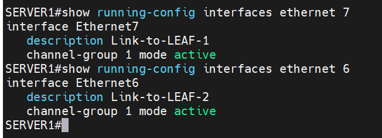

### VxLAN VPC.

- Part 1: Подключите клиентов 2-я линками к различным Leaf.
- Part 2: Настроите агрегированный канал со стороны клиента.
- Part 3: Настроите VPC(MLAG) для работы в Overlay сети.
- Part 4: Зафиксируете в документации - адресное пространство, схему сети, конфигурацию устройств

### 1: Подключите клиентов 2-я линками к различным Leaf.

### 2: Настроите агрегированный канал со стороны клиента.

### 3: Настроите VPC(MLAG) для работы в Overlay сети.

VxLAN туннель поднят, маршруты Type2 и Type3 изучены и  присутствуют в таблице RIB l2vpn

### 4: Зафиксируете в документации - адресное пространство, схему сети, конфигурацию устройств

### PTP link

|IP subnet|Subnet Mask|Description
|---|---|---|
172.16.1.0|255.255.255.254|Leaf1-Spine1
172.16.2.0|255.255.255.254|Leaf1-Spine2
172.16.3.0|255.255.255.254|Leaf2-Spine1
172.16.4.0|255.255.255.254|Leaf2-Spine2
172.16.5.0|255.255.255.254|Leaf3-Spine1
172.16.6.0|255.255.255.254|Leaf3-Spine2
172.16.7.0|255.255.255.254|Leaf4-Spine1
172.16.8.0|255.255.255.254|Leaf4-Spine2
192.168.1.0|255.255.255.252|Leaf1-Leaf2
192.168.10.0|255.255.255.252|Leaf1-Leaf2
192.168.2.0|255.255.255.252|Leaf3-Leaf4 
192.168.20.0|255.255.255.252|Leaf3-Leaf4

### Loopback link

|Device|IP Address|Subnet Mask
|---|---|---|
Leaf-1|1.1.1.1|255.255.255.255
Leaf-1|10.10.10.10|255.255.255.255
Leaf-2|1.1.1.2|255.255.255.255
Leaf-2|20.20.20.20|255.255.255.255
Leaf-3|1.1.1.3|255.255.255.255
Leaf-3|30.30.30.30|255.255.255.255
Leaf-4|1.1.1.4|255.255.255.255
Leaf-4|40.40.40.40|255.255.255.255
Spine-1|2.2.2.1|255.255.255.255
Spine-2|2.2.2.2|255.255.255.255

### VLAN 100

|Device|IP Address|Subnet Mask
|---|---|---|
SERVER1|172.16.100.2|255.255.255.0
SERVER2|172.16.100.3|255.255.255.0

Конфиги устройств, прикладываю в отдельной папке

