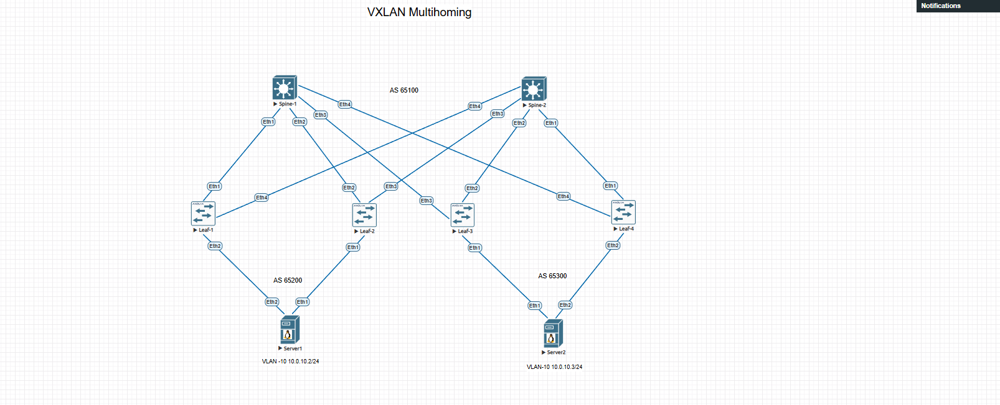

# VXLAN. Multihoming.


## Планы работ:

- 1:  Зафиксировать адресное пространство, схему сети, конфигурацию устройств

- 2:  Настроите агрегированный канал со стороны клиента

- 3:  Настроите multihoming для работы в Overlay сети
- 4:  Опционально - протестировать отказоустойчивость - убедиться, что связнность не теряется при отключении одного из линков


## Схема сети:



## Конфигурации устройств:

 - [spine-1](Config/spine-1.cfg)

 - [spine-2](Config/spine-2.cfg)

 - [leaf-1](Config/leaf-1.cfg)

 - [leaf-2](Config/leaf-2.cfg)

 - [leaf-3](Config/leaf-3.cfg)

 - [leaf-4](Config/leaf-4.cfg)

 - [server-1](Config/server-1.cfg)

 - [server-2](Config/server-2.cfg)


## 1 Зафиксированное адресное пространство


### PTP link


|IP subnet|Subnet Mask|Description
|---|---|---|
172.16.1.0|255.255.255.254|Leaf1-Spine1
172.16.2.0|255.255.255.254|Leaf1-Spine2
172.16.3.0|255.255.255.254|Leaf2-Spine1
172.16.4.0|255.255.255.254|Leaf2-Spine2
172.16.5.0|255.255.255.254|Leaf3-Spine1
172.16.6.0|255.255.255.254|Leaf3-Spine2
172.16.7.0|255.255.255.254|Leaf4-Spine1
172.16.8.0|255.255.255.254|Leaf4-Spine2


### Loopback link


|Device|IP Address|Subnet Mask
|---|---|---|
Leaf-1|1.1.1.1|255.255.255.255
Leaf-1|1.1.2.1|255.255.255.255
Leaf-2|1.1.1.2|255.255.255.255
Leaf-2|1.1.2.2|255.255.255.255
Leaf-3|1.1.1.3|255.255.255.255
Leaf-3|1.1.2.3|255.255.255.255
Leaf-4|1.1.1.4|255.255.255.255
Leaf-4|1.1.2.4|255.255.255.255
Spine-1|2.2.2.1|255.255.255.255
Spine-2|2.2.2.2|255.255.255.255


### VLAN-10


|Device|IP Address|Subnet Mask
|---|---|---|
SERVER-1|10.0.10.2|255.255.255.0
SERVER-2|10.0.10.3|255.255.255.0
Gateway|10.0.10.1|255.255.255.0


## 2 Настроите агрегированный канал со стороны клиента

### SERVER-1:

```
SERVER-1#show lacp peer

State: A = Active, P = Passive; S=ShortTimeout, L=LongTimeout;

      G = Aggregable, I = Individual; s+=InSync, s-=OutOfSync;

      C = Collecting, X = state machine expired,

      D = Distributing, d = default neighbor state

                |                        Partner

Port    Status  | Sys-id                    Port#   State     OperKey  PortPri

------ ----------|------------------------- ------- --------- --------- -------

Port Channel Port-Channel1:

Et1     Bundled | 8000,00-00-00-00-12-01        1   ALGs+CD    0x0001    32768

Et2     Bundled | 8000,00-00-00-00-12-01        2   ALGs+CD    0x0001    32768


SERVER-1#

```

### SERVER-2:

```
SERVER-2#show port-channel brief

Port Channel Port-Channel1:

 Active Ports: Ethernet1 Ethernet2

SERVER-2#show lacp peer

State: A = Active, P = Passive; S=ShortTimeout, L=LongTimeout;

      G = Aggregable, I = Individual; s+=InSync, s-=OutOfSync;

      C = Collecting, X = state machine expired,

      D = Distributing, d = default neighbor state

                |                        Partner

Port    Status  | Sys-id                    Port#   State     OperKey  PortPri

------ ----------|------------------------- ------- --------- --------- -------

Port Channel Port-Channel1:

Et1     Bundled | 8000,00-00-00-00-34-01        1   ALGs+CD    0x0001    32768

Et2     Bundled | 8000,00-00-00-00-34-01        2   ALGs+CD    0x0001    32768


SERVER-2#

```

## 3 Настроите multihoming для работы в Overlay сети


### Leaf-1:


```
Leaf-1#show vxlan vtep

Remote VTEPS for Vxlan1:


VTEP          Tunnel Type(s)

------------- --------------

1.1.2.3       unicast, flood

1.1.2.4       unicast, flood


Total number of remote VTEPS:  2

Leaf-1#

Leaf-1#show lacp peer

State: A = Active, P = Passive; S=ShortTimeout, L=LongTimeout;

      G = Aggregable, I = Individual; s+=InSync, s-=OutOfSync;

      C = Collecting, X = state machine expired,

      D = Distributing, d = default neighbor state

                |                        Partner

Port    Status  | Sys-id                    Port#   State     OperKey  PortPri

------ ----------|------------------------- ------- --------- --------- -------

Port Channel Port-Channel1:

Et2     Bundled | 8000,50-01-00-9b-56-6c        2   ALGs+CD    0x0001    32768


Leaf-1#show bgp evpn

BGP routing table information for VRF default

Router identifier 1.1.1.1, local AS number 65200

Route status codes: * - valid, > - active, S - Stale, E - ECMP head, e - ECMP

                   c - Contributing to ECMP, % - Pending BGP convergence

Origin codes: i - IGP, e - EGP, ? - incomplete

AS Path Attributes: Or-ID - Originator ID, C-LST - Cluster List, LL Nexthop - Link Local Nexthop


         Network                Next Hop              Metric  LocPref Weight  Path

* >      RD: 1.1.1.1:10 auto-discovery 0 0000:0000:0000:0000:1201

                                -                     -       -       0       i

* >      RD: 1.1.2.1:1 auto-discovery 0000:0000:0000:0000:1201

                                -                     -       -       0       i

* >Ec    RD: 1.1.1.3:10 auto-discovery 0 0000:0000:0000:0000:3401

                                1.1.2.3               -       100     0       65100 65300 i

*  ec    RD: 1.1.1.3:10 auto-discovery 0 0000:0000:0000:0000:3401

                                1.1.2.3               -       100     0       65100 65300 i

* >Ec    RD: 1.1.1.4:10 auto-discovery 0 0000:0000:0000:0000:3401

                                1.1.2.4               -       100     0       65100 65300 i

*  ec    RD: 1.1.1.4:10 auto-discovery 0 0000:0000:0000:0000:3401

                                1.1.2.4               -       100     0       65100 65300 i

* >Ec    RD: 1.1.2.3:1 auto-discovery 0000:0000:0000:0000:3401

                                1.1.2.3               -       100     0       65100 65300 i

*  ec    RD: 1.1.2.3:1 auto-discovery 0000:0000:0000:0000:3401

                                1.1.2.3               -       100     0       65100 65300 i

* >Ec    RD: 1.1.2.4:1 auto-discovery 0000:0000:0000:0000:3401

                                1.1.2.4               -       100     0       65100 65300 i

*  ec    RD: 1.1.2.4:1 auto-discovery 0000:0000:0000:0000:3401

                                1.1.2.4               -       100     0       65100 65300 i

* >Ec    RD: 1.1.1.3:10 mac-ip 5001.0026.397b

                                1.1.2.3               -       100     0       65100 65300 i

*  ec    RD: 1.1.1.3:10 mac-ip 5001.0026.397b

                                1.1.2.3               -       100     0       65100 65300 i

* >      RD: 1.1.1.1:10 imet 1.1.2.1

                                -                     -       -       0       i

* >Ec    RD: 1.1.1.3:10 imet 1.1.2.3

                                1.1.2.3               -       100     0       65100 65300 i

*  ec    RD: 1.1.1.3:10 imet 1.1.2.3

                                1.1.2.3               -       100     0       65100 65300 i

* >Ec    RD: 1.1.1.4:10 imet 1.1.2.4

                                1.1.2.4               -       100     0       65100 65300 i

*  ec    RD: 1.1.1.4:10 imet 1.1.2.4

                                1.1.2.4               -       100     0       65100 65300 i

* >      RD: 1.1.2.1:1 ethernet-segment 0000:0000:0000:0000:1201 1.1.2.1

                                -                     -       -       0       i

* >Ec    RD: 1.1.2.3:1 ethernet-segment 0000:0000:0000:0000:3401 1.1.2.3

                                1.1.2.3               -       100     0       65100 65300 i

*  ec    RD: 1.1.2.3:1 ethernet-segment 0000:0000:0000:0000:3401 1.1.2.3

                                1.1.2.3               -       100     0       65100 65300 i

* >Ec    RD: 1.1.2.4:1 ethernet-segment 0000:0000:0000:0000:3401 1.1.2.4

                                1.1.2.4               -       100     0       65100 65300 i

*  ec    RD: 1.1.2.4:1 ethernet-segment 0000:0000:0000:0000:3401 1.1.2.4

                                1.1.2.4               -       100     0       65100 65300 i

Leaf-1#

```


### Leaf-2:

```
Leaf-2#show vxlan vtep

Remote VTEPS for Vxlan1:


VTEP          Tunnel Type(s)

------------- --------------

1.1.2.3       flood, unicast

1.1.2.4       flood, unicast


Total number of remote VTEPS:  2

Leaf-2#show lacp peer

State: A = Active, P = Passive; S=ShortTimeout, L=LongTimeout;

      G = Aggregable, I = Individual; s+=InSync, s-=OutOfSync;

      C = Collecting, X = state machine expired,

      D = Distributing, d = default neighbor state

                |                        Partner

Port    Status  | Sys-id                    Port#   State     OperKey  PortPri

------ ----------|------------------------- ------- --------- --------- -------

Port Channel Port-Channel1:

Et1     Bundled | 8000,50-01-00-9b-56-6c        1   ALGs+CD    0x0001    32768


Leaf-2#show bgp evpn

BGP routing table information for VRF default

Router identifier 1.1.1.2, local AS number 65200

Route status codes: * - valid, > - active, S - Stale, E - ECMP head, e - ECMP

                   c - Contributing to ECMP, % - Pending BGP convergence

Origin codes: i - IGP, e - EGP, ? - incomplete

AS Path Attributes: Or-ID - Originator ID, C-LST - Cluster List, LL Nexthop - Link Local Nexthop


         Network                Next Hop              Metric  LocPref Weight  Path

* >      RD: 1.1.1.2:10 auto-discovery 0 0000:0000:0000:0000:1201

                                -                     -       -       0       i

* >      RD: 1.1.2.2:1 auto-discovery 0000:0000:0000:0000:1201

                                -                     -       -       0       i

* >Ec    RD: 1.1.1.3:10 auto-discovery 0 0000:0000:0000:0000:3401

                                1.1.2.3               -       100     0       65100 65300 i

*  ec    RD: 1.1.1.3:10 auto-discovery 0 0000:0000:0000:0000:3401

                                1.1.2.3               -       100     0       65100 65300 i

* >Ec    RD: 1.1.1.4:10 auto-discovery 0 0000:0000:0000:0000:3401

                                1.1.2.4               -       100     0       65100 65300 i

*  ec    RD: 1.1.1.4:10 auto-discovery 0 0000:0000:0000:0000:3401

                                1.1.2.4               -       100     0       65100 65300 i

* >Ec    RD: 1.1.2.3:1 auto-discovery 0000:0000:0000:0000:3401

                                1.1.2.3               -       100     0       65100 65300 i

*  ec    RD: 1.1.2.3:1 auto-discovery 0000:0000:0000:0000:3401

                                1.1.2.3               -       100     0       65100 65300 i

* >Ec    RD: 1.1.2.4:1 auto-discovery 0000:0000:0000:0000:3401

                                1.1.2.4               -       100     0       65100 65300 i

*  ec    RD: 1.1.2.4:1 auto-discovery 0000:0000:0000:0000:3401

                                1.1.2.4               -       100     0       65100 65300 i

* >Ec    RD: 1.1.1.3:10 mac-ip 5001.0026.397b

                                1.1.2.3               -       100     0       65100 65300 i

*  ec    RD: 1.1.1.3:10 mac-ip 5001.0026.397b

                                1.1.2.3               -       100     0       65100 65300 i

* >      RD: 1.1.1.2:10 mac-ip 5001.009b.566c

                                -                     -       -       0       i

* >      RD: 1.1.1.2:10 mac-ip 5001.009b.566c 10.0.10.2

                                -                     -       -       0       i

* >      RD: 1.1.1.2:10 imet 1.1.2.2

                                -                     -       -       0       i

* >Ec    RD: 1.1.1.3:10 imet 1.1.2.3

                                1.1.2.3               -       100     0       65100 65300 i

*  ec    RD: 1.1.1.3:10 imet 1.1.2.3

                                1.1.2.3               -       100     0       65100 65300 i

* >Ec    RD: 1.1.1.4:10 imet 1.1.2.4

                                1.1.2.4               -       100     0       65100 65300 i

*  ec    RD: 1.1.1.4:10 imet 1.1.2.4

                                1.1.2.4               -       100     0       65100 65300 i

* >      RD: 1.1.2.2:1 ethernet-segment 0000:0000:0000:0000:1201 1.1.2.2

                                -                     -       -       0       i

* >Ec    RD: 1.1.2.3:1 ethernet-segment 0000:0000:0000:0000:3401 1.1.2.3

                                1.1.2.3               -       100     0       65100 65300 i

*  ec    RD: 1.1.2.3:1 ethernet-segment 0000:0000:0000:0000:3401 1.1.2.3

                                1.1.2.3               -       100     0       65100 65300 i

* >Ec    RD: 1.1.2.4:1 ethernet-segment 0000:0000:0000:0000:3401 1.1.2.4

                                1.1.2.4               -       100     0       65100 65300 i

*  ec    RD: 1.1.2.4:1 ethernet-segment 0000:0000:0000:0000:3401 1.1.2.4

                                1.1.2.4               -       100     0       65100 65300 i

Leaf-2#

```

### Leaf-3:

```
Leaf-3#show vxlan vtep

Remote VTEPS for Vxlan1:


VTEP          Tunnel Type(s)

------------- --------------

1.1.2.1       unicast, flood

1.1.2.2       unicast, flood


Total number of remote VTEPS:  2

Leaf-3#

Leaf-3#show lacp peer

State: A = Active, P = Passive; S=ShortTimeout, L=LongTimeout;

      G = Aggregable, I = Individual; s+=InSync, s-=OutOfSync;

      C = Collecting, X = state machine expired,

      D = Distributing, d = default neighbor state

                |                        Partner

Port    Status  | Sys-id                    Port#   State     OperKey  PortPri

------ ----------|------------------------- ------- --------- --------- -------

Port Channel Port-Channel1:

Et1     Bundled | 8000,50-01-00-26-39-7b        1   ALGs+CD    0x0001    32768


Leaf-3#show bgp evpn

BGP routing table information for VRF default

Router identifier 1.1.1.3, local AS number 65300

Route status codes: * - valid, > - active, S - Stale, E - ECMP head, e - ECMP

                   c - Contributing to ECMP, % - Pending BGP convergence

Origin codes: i - IGP, e - EGP, ? - incomplete

AS Path Attributes: Or-ID - Originator ID, C-LST - Cluster List, LL Nexthop - Link Local Nexthop


         Network                Next Hop              Metric  LocPref Weight  Path

* >Ec    RD: 1.1.1.1:10 auto-discovery 0 0000:0000:0000:0000:1201

                                1.1.2.1               -       100     0       65100 65200 i

*  ec    RD: 1.1.1.1:10 auto-discovery 0 0000:0000:0000:0000:1201

                                1.1.2.1               -       100     0       65100 65200 i

* >Ec    RD: 1.1.1.2:10 auto-discovery 0 0000:0000:0000:0000:1201

                                1.1.2.2               -       100     0       65100 65200 i

*  ec    RD: 1.1.1.2:10 auto-discovery 0 0000:0000:0000:0000:1201

                                1.1.2.2               -       100     0       65100 65200 i

* >Ec    RD: 1.1.2.1:1 auto-discovery 0000:0000:0000:0000:1201

                                1.1.2.1               -       100     0       65100 65200 i

*  ec    RD: 1.1.2.1:1 auto-discovery 0000:0000:0000:0000:1201

                                1.1.2.1               -       100     0       65100 65200 i

* >Ec    RD: 1.1.2.2:1 auto-discovery 0000:0000:0000:0000:1201

                                1.1.2.2               -       100     0       65100 65200 i

*  ec    RD: 1.1.2.2:1 auto-discovery 0000:0000:0000:0000:1201

                                1.1.2.2               -       100     0       65100 65200 i

* >      RD: 1.1.1.3:10 auto-discovery 0 0000:0000:0000:0000:3401

                                -                     -       -       0       i

* >      RD: 1.1.2.3:1 auto-discovery 0000:0000:0000:0000:3401

                                -                     -       -       0       i

* >      RD: 1.1.1.3:10 mac-ip 5001.0026.397b

                                -                     -       -       0       i

* >Ec    RD: 1.1.1.2:10 mac-ip 5001.009b.566c

                                1.1.2.2               -       100     0       65100 65200 i

*  ec    RD: 1.1.1.2:10 mac-ip 5001.009b.566c

                                1.1.2.2               -       100     0       65100 65200 i

* >Ec    RD: 1.1.1.2:10 mac-ip 5001.009b.566c 10.0.10.2

                                1.1.2.2               -       100     0       65100 65200 i

*  ec    RD: 1.1.1.2:10 mac-ip 5001.009b.566c 10.0.10.2

                                1.1.2.2               -       100     0       65100 65200 i

* >Ec    RD: 1.1.1.1:10 imet 1.1.2.1

                                1.1.2.1               -       100     0       65100 65200 i

*  ec    RD: 1.1.1.1:10 imet 1.1.2.1

                                1.1.2.1               -       100     0       65100 65200 i

* >Ec    RD: 1.1.1.2:10 imet 1.1.2.2

                                1.1.2.2               -       100     0       65100 65200 i

*  ec    RD: 1.1.1.2:10 imet 1.1.2.2

                                1.1.2.2               -       100     0       65100 65200 i

* >      RD: 1.1.1.3:10 imet 1.1.2.3

                                -                     -       -       0       i

* >Ec    RD: 1.1.2.1:1 ethernet-segment 0000:0000:0000:0000:1201 1.1.2.1

                                1.1.2.1               -       100     0       65100 65200 i

*  ec    RD: 1.1.2.1:1 ethernet-segment 0000:0000:0000:0000:1201 1.1.2.1

                                1.1.2.1               -       100     0       65100 65200 i

* >Ec    RD: 1.1.2.2:1 ethernet-segment 0000:0000:0000:0000:1201 1.1.2.2

                                1.1.2.2               -       100     0       65100 65200 i

*  ec    RD: 1.1.2.2:1 ethernet-segment 0000:0000:0000:0000:1201 1.1.2.2

                                1.1.2.2               -       100     0       65100 65200 i

* >      RD: 1.1.2.3:1 ethernet-segment 0000:0000:0000:0000:3401 1.1.2.3

                                -                     -       -       0       i

Leaf-3#

```

### Leaf-4:

```
Leaf-4#show vxlan vtep

Remote VTEPS for Vxlan1:


VTEP          Tunnel Type(s)

------------- --------------

1.1.2.1       flood, unicast

1.1.2.2       flood, unicast


Total number of remote VTEPS:  2

Leaf-4#

Leaf-4#show lacp peer

State: A = Active, P = Passive; S=ShortTimeout, L=LongTimeout;

      G = Aggregable, I = Individual; s+=InSync, s-=OutOfSync;

      C = Collecting, X = state machine expired,

      D = Distributing, d = default neighbor state

                |                        Partner

Port    Status  | Sys-id                    Port#   State     OperKey  PortPri

------ ----------|------------------------- ------- --------- --------- -------

Port Channel Port-Channel1:

Et2     Bundled | 8000,50-01-00-26-39-7b        2   ALGs+CD    0x0001    32768


Leaf-4#show bgp evpn

BGP routing table information for VRF default

Router identifier 1.1.1.4, local AS number 65300

Route status codes: * - valid, > - active, S - Stale, E - ECMP head, e - ECMP

                   c - Contributing to ECMP, % - Pending BGP convergence

Origin codes: i - IGP, e - EGP, ? - incomplete

AS Path Attributes: Or-ID - Originator ID, C-LST - Cluster List, LL Nexthop - Link Local Nexthop


         Network                Next Hop              Metric  LocPref Weight  Path

* >Ec    RD: 1.1.1.1:10 auto-discovery 0 0000:0000:0000:0000:1201

                                1.1.2.1               -       100     0       65100 65200 i

*  ec    RD: 1.1.1.1:10 auto-discovery 0 0000:0000:0000:0000:1201

                                1.1.2.1               -       100     0       65100 65200 i

* >Ec    RD: 1.1.1.2:10 auto-discovery 0 0000:0000:0000:0000:1201

                                1.1.2.2               -       100     0       65100 65200 i

*  ec    RD: 1.1.1.2:10 auto-discovery 0 0000:0000:0000:0000:1201

                                1.1.2.2               -       100     0       65100 65200 i

* >Ec    RD: 1.1.2.1:1 auto-discovery 0000:0000:0000:0000:1201

                                1.1.2.1               -       100     0       65100 65200 i

*  ec    RD: 1.1.2.1:1 auto-discovery 0000:0000:0000:0000:1201

                                1.1.2.1               -       100     0       65100 65200 i

* >Ec    RD: 1.1.2.2:1 auto-discovery 0000:0000:0000:0000:1201

                                1.1.2.2               -       100     0       65100 65200 i

*  ec    RD: 1.1.2.2:1 auto-discovery 0000:0000:0000:0000:1201

                                1.1.2.2               -       100     0       65100 65200 i

* >      RD: 1.1.1.4:10 auto-discovery 0 0000:0000:0000:0000:3401

                                -                     -       -       0       i

* >      RD: 1.1.2.4:1 auto-discovery 0000:0000:0000:0000:3401

                                -                     -       -       0       i

* >Ec    RD: 1.1.1.2:10 mac-ip 5001.009b.566c

                                1.1.2.2               -       100     0       65100 65200 i

*  ec    RD: 1.1.1.2:10 mac-ip 5001.009b.566c

                                1.1.2.2               -       100     0       65100 65200 i

* >Ec    RD: 1.1.1.2:10 mac-ip 5001.009b.566c 10.0.10.2

                                1.1.2.2               -       100     0       65100 65200 i

*  ec    RD: 1.1.1.2:10 mac-ip 5001.009b.566c 10.0.10.2

                                1.1.2.2               -       100     0       65100 65200 i

* >Ec    RD: 1.1.1.1:10 imet 1.1.2.1

                                1.1.2.1               -       100     0       65100 65200 i

*  ec    RD: 1.1.1.1:10 imet 1.1.2.1

                                1.1.2.1               -       100     0       65100 65200 i

* >Ec    RD: 1.1.1.2:10 imet 1.1.2.2

                                1.1.2.2               -       100     0       65100 65200 i

*  ec    RD: 1.1.1.2:10 imet 1.1.2.2

                                1.1.2.2               -       100     0       65100 65200 i

* >      RD: 1.1.1.4:10 imet 1.1.2.4

                                -                     -       -       0       i

* >Ec    RD: 1.1.2.1:1 ethernet-segment 0000:0000:0000:0000:1201 1.1.2.1

                                1.1.2.1               -       100     0       65100 65200 i

*  ec    RD: 1.1.2.1:1 ethernet-segment 0000:0000:0000:0000:1201 1.1.2.1

                                1.1.2.1               -       100     0       65100 65200 i

* >Ec    RD: 1.1.2.2:1 ethernet-segment 0000:0000:0000:0000:1201 1.1.2.2

                                1.1.2.2               -       100     0       65100 65200 i

*  ec    RD: 1.1.2.2:1 ethernet-segment 0000:0000:0000:0000:1201 1.1.2.2

                                1.1.2.2               -       100     0       65100 65200 i

* >      RD: 1.1.2.4:1 ethernet-segment 0000:0000:0000:0000:3401 1.1.2.4

                                -                     -       -       0       i

Leaf-4#

```


## 4  Опционально - протестировать отказоустойчивость:


### SERVER-1:

```
SERVER-1#show lacp peer

State: A = Active, P = Passive; S=ShortTimeout, L=LongTimeout;

      G = Aggregable, I = Individual; s+=InSync, s-=OutOfSync;

      C = Collecting, X = state machine expired,

      D = Distributing, d = default neighbor state

                |                        Partner

Port    Status  | Sys-id                    Port#   State     OperKey  PortPri

------ ----------|------------------------- ------- --------- --------- -------

Port Channel Port-Channel1:

Et1     Bundled | 8000,00-00-00-00-12-01        1   ALGs+CD    0x0001    32768

Et2     Bundled | 8000,00-00-00-00-12-01        2   ALGs+CD    0x0001    32768


SERVER-1#conf ter

SERVER-1(config)#interface ethernet 2

SERVER-1(config-if-Et2)#shutdown

SERVER-1(config-if-Et2)#end

SERVER-1#show interfaces status

Port       Name   Status       Vlan     Duplex Speed  Type            Flags Encapsulation

Et1               connected    in Po1   full   1G     EbraTestPhyPort

Et2               disabled     in Po1   full   1G     EbraTestPhyPort

Et3               connected    1        full   1G     EbraTestPhyPort

Et4               connected    1        full   1G     EbraTestPhyPort

Et5               connected    1        full   1G     EbraTestPhyPort

Et6               connected    1        full   1G     EbraTestPhyPort

Et7               connected    1        full   1G     EbraTestPhyPort

Et8               connected    1        full   1G     EbraTestPhyPort

Ma1               connected    routed   a-full a-1G   10/100/1000

Po1               connected    trunk    full   1G     N/A


SERVER-1#show ip interface brief

                                                                       Address

Interface        IP Address        Status      Protocol          MTU    Owner

---------------- ----------------- ----------- ------------- ---------- -------

Management1      unassigned        up          up               1500

Vlan10           10.0.10.2/24      up          up               1500


SERVER-1#ping 10.0.10.3

PING 10.0.10.3 (10.0.10.3) 72(100) bytes of data.

80 bytes from 10.0.10.3: icmp_seq=1 ttl=64 time=47.4 ms

80 bytes from 10.0.10.3: icmp_seq=2 ttl=64 time=38.1 ms

80 bytes from 10.0.10.3: icmp_seq=3 ttl=64 time=29.2 ms

80 bytes from 10.0.10.3: icmp_seq=4 ttl=64 time=50.9 ms

80 bytes from 10.0.10.3: icmp_seq=5 ttl=64 time=47.6 ms


--- 10.0.10.3 ping statistics ---

5 packets transmitted, 5 received, 0% packet loss, time 46ms

rtt min/avg/max/mdev = 29.208/42.682/50.944/7.979 ms, pipe 5, ipg/ewma 11.620/45.339 ms

SERVER-1#

```


