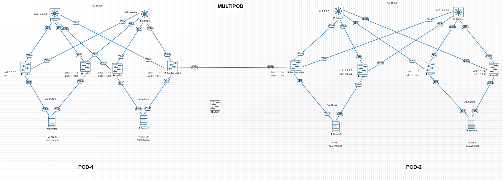
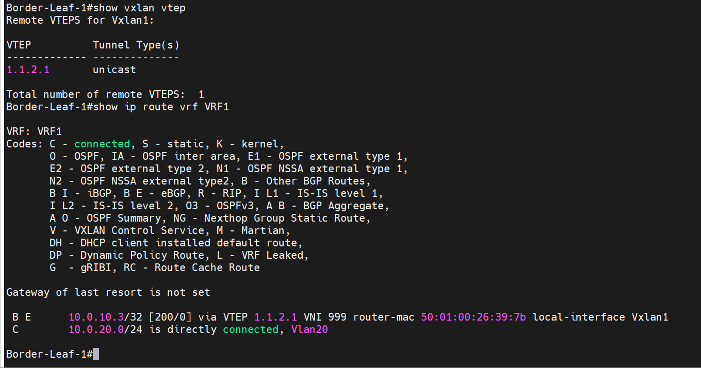
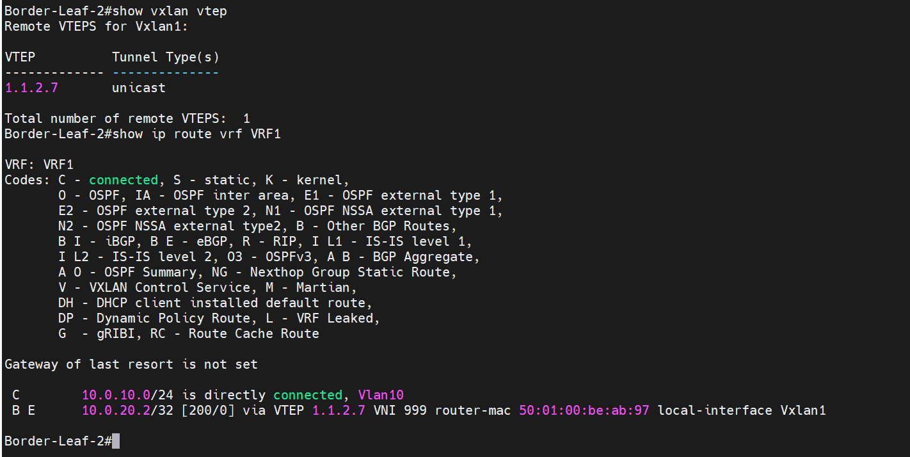

# Масштабирование L2-сегмента между двумя центрами обработки данных (ЦОД) с помощью технологии EVPN-VXLAN"

### Схема сети:

###  Проверка  поднятие vxlan тунелей, и l3 маршрутизации в каждом поде.

### POD-1:

### POD-2:
